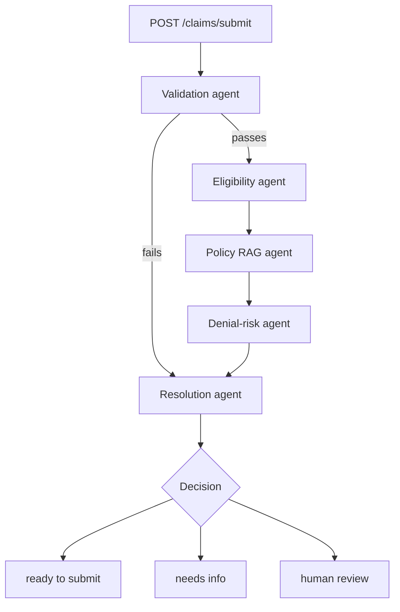

# Architecture

## Agents

**Validation** checks claim completeness and procedure/diagnosis code format.
Rule-based, no LLM call. A claim that fails validation skips straight to
resolution instead of running eligibility and risk scoring against data that
can't be trusted.

**Eligibility** looks up the member's plan status and coverage dates against
`data/members.csv`. Rule-based lookup, no LLM call.

**Policy RAG** retrieves the policy text relevant to the claim's procedure
code (for example, whether it needs prior authorization) from a Chroma
collection built over `data/policy_docs/`. Retrieval uses TF-IDF fit on the
fixed policy corpus, so it runs offline with no model download. Answer
synthesis calls Gemini when `GOOGLE_API_KEY` is set, grounded strictly in the
retrieved text; without a key it returns the retrieved excerpts directly.

**Denial-risk** scores the claim's denial probability with a trained
XGBoost model (`models/denial_risk_model.json`), called directly as a
function, not through an LLM.

**Resolution** combines the outputs of the four upstream agents into one of
three outcomes: ready to submit, needs info, or human review. High-risk or
low-confidence cases route to human review rather than an automated guess.

## Data flow

Each agent reads the claim plus the accumulated state from prior agents and
writes its own typed output back into that state. The API returns the final
decision along with the reasoning trace from every agent that ran, so a
caller can see why a claim was routed the way it was, not just the outcome.

## Deployment

The API is packaged as a single Docker image (see `Dockerfile`) that installs
dependencies, copies the agents/API/data/models directories, and serves
FastAPI with uvicorn on port 8080. The Chroma index is rebuilt from
`data/policy_docs/` at container startup rather than shipped in the image, so
the image stays small and the index can't go stale relative to the docs.
Target hosting is Google Cloud Run's Always Free tier.
